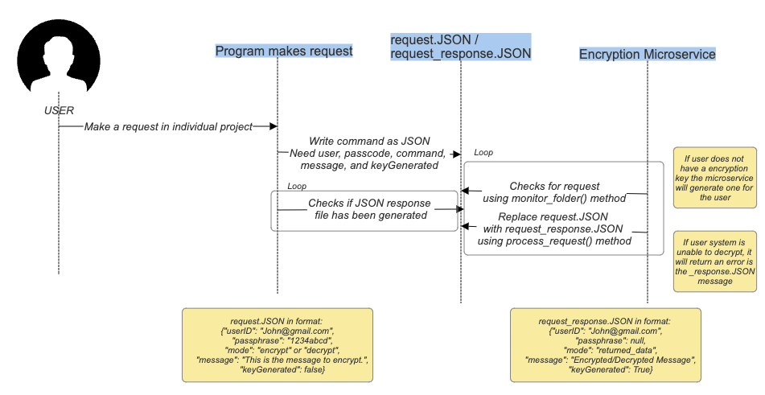

# README for Encryption/Decryption Microservice
CS 361 Microservice

Introduction
This microservice provides on-the-fly encryption and decryption of data using PGP keys.
Users can request encryption or decryption by placing a JSON file in a specified directory.
The service continuously monitors this directory, processes requests as they appear,
and generates a response in JSON format.

How to Use
Prepare a JSON Request: Create a JSON file with the following structure:

{
  "userID": "user@example.com",
  "passphrase": "your_passphrase",
  "mode": "encrypt or decrypt",
  "message": "Your message here"
}

userID: Your email address, used as an identifier for generating/retrieving PGP keys.
passphrase: Passphrase for your PGP key. Required for decryption and key generation.
mode: Request mode, either encrypt or decrypt.
message: The message to be encrypted or decrypted.

## Request Data

Place JSON Request in the Watch Folder: Save your JSON file to the specified watch folder (./watch_folder).

## Receive Data

Receive Response: The service processes files in the watch folder and generates a response file named
<original_filename>_response.json with the following structure:

{
  "userID": "user@example.com",
  "passphrase": null,
  "mode": "returned_data",
  "message": "Processed message here",
  "keyGenerated": false or true
}

message: The encrypted message or decrypted plaintext, depending on the request.
keyGenerated: Indicates whether a new PGP key was generated for the user.

## UML Sequence Diagram

